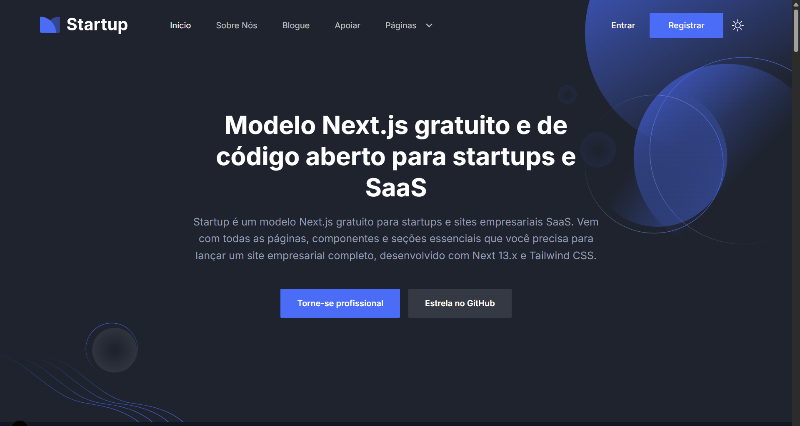

# Startup - Modelo de Site para Startup Next.js Gratuito

Startup é um projeto gratuito, de código aberto e de alta qualidade que inclui tudo o que você precisa para lançar um site para startup, negócio ou SaaS, incluindo todas as seções, componentes e páginas essenciais.

Se você procura um modelo Next.js de alta qualidade, visualmente atraente e rico em recursos para o seu próximo site de startup, SaaS ou negócio, esta é a escolha perfeita e o ponto de partida para você!

### ✨ Principais Recursos
- Criado para Startups e Negócios SaaS
- Next.js e Tailwind CSS
- Todas as Seções e Páginas Essenciais para Negócios
- Design Limpo e de Alta Qualidade
- Versão Clara e Escura
- Suporte a TypeScript
e Muito Mais...

### 📄 Licença
O Startup é 100% gratuito e de código aberto, sinta-se à vontade para usá-lo em seus projetos pessoais e comerciais.

### 💜 Suporte
Se você gostar do modelo, marque este repositório com uma estrela para inspirar a equipe a criar mais coisas como esta e alcançar mais usuários como você!

### Registro de Atualizações

**10 de abril de 2025**
- Corrigido problema de dependências de pares com o Next.js 15
- Atualização para o Tailwind v4
- Cartões de blog refatorados para lidar com casos extremos (reticências no texto da biografia, manter os detalhes do autor na parte inferior, etc.)
- Reescrita da página de detalhes do blog com separação de ícones, imagem de autor reserva e melhor marcação.
- Corrigidos erros de chave duplicada na página inicial.
- Ícones separados no botão de alternador de temas e botão de rolagem para o topo refatorado.

**29 de janeiro de 2025**
- Atualizado para o Next.js 15